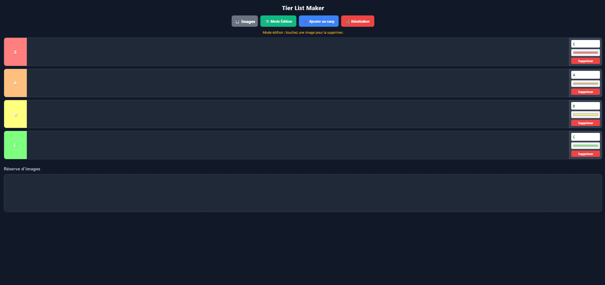

<h1 align="center">
  
</h1>


---

# Tier List Maker — Mobile Pro

## Aperçu
Application web pour créer des tier lists depuis son téléphone ou son ordinateur. **100% locale** : aucune image n'est envoyée sur un serveur — tout est stocké dans le navigateur (`localStorage`). Un seul fichier HTML, zéro dépendance, zéro build. On uploade ses images, on les glisse dans les rangs (S / A / B / C…), et tout est sauvegardé automatiquement.

## Fonctionnalités

### Tier list
- 4 rangs par défaut (**S / A / B / C**) avec leurs couleurs classiques
- Rangs entièrement personnalisables en mode édition : **renommer**, **changer la couleur** (sélecteur natif), **supprimer** (ses images retournent dans la réserve), **ajouter** autant de rangs que voulu
- **Réserve d'images** en bas de page : les images uploadées y atterrissent avant d'être classées

### Drag & drop (souris ET tactile)
- Glisser-déposer unifié via **Pointer Events** — même comportement à la souris et au doigt
- **Seuil de 8px** avant de démarrer un drag : un simple tap ne déplace rien (pas de faux positifs sur mobile)
- L'image suit le doigt avec un effet de zoom + ombre, et la zone de drop survolée est **surlignée en bleu**
- **Auto-scroll** : pendant un drag, approcher le doigt du bord haut/bas de l'écran fait défiler la page — indispensable pour remonter de la réserve vers les rangs du haut sur mobile
- Lâcher une image sur le label ou le panneau d'un rang compte comme un drop dans ce rang
- Le scroll de la page reste fluide partout ailleurs (seules les images bloquent le geste)
- Drag natif HTML5 et menu contextuel au long-press neutralisés (pas de "Enregistrer l'image sous…" intempestif)

### Upload d'images
- Bouton **📥 Images** — sélection multiple, tous formats image acceptés
- Chaque image est **redimensionnée en 150×150** (recadrage centré type `cover`) et compressée en **WebP** (fallback JPEG) — des dizaines d'images tiennent dans le stockage du navigateur
- Une image illisible est ignorée sans bloquer les autres
- Possibilité de ré-uploader le même fichier immédiatement

### Mode édition
- Bouton **⚙️ Mode Édition** (devient vert quand actif)
- Affiche le panneau de chaque rang : champ nom, sélecteur couleur, bouton Supprimer
- **Tap sur une image = suppression** (avec confirmation)
- Bouton **➕ Ajouter un rang** et **♻️ Réinitialiser** (avec confirmation) visibles uniquement en mode édition

### Sauvegarde automatique
- Tout l'état (rangs, noms, couleurs, position de chaque image) est sauvegardé dans `localStorage` — **rien ne quitte l'appareil**
- Sauvegarde immédiate après chaque action, avec un léger debounce (300ms) pendant la frappe au clavier
- Restauration automatique à l'ouverture de la page, avec validation des données (une sauvegarde corrompue repart proprement de zéro)
- **Alerte stockage plein** : si le quota du navigateur est atteint, l'app prévient une seule fois au lieu d'échouer en silence

### Sécurité
- **Content-Security-Policy stricte** : `default-src 'none'` — la page ne peut contacter **aucun** serveur, les images sont limitées à `data:`/`blob:`
- **Aucun `innerHTML`** : tout le DOM est construit par `createElement` — aucune injection possible, même avec un `localStorage` forgé

## Technologies
- **HTML / CSS / JavaScript vanilla** — un seul fichier, aucun framework, aucun build, aucune dépendance
- **Pointer Events** (drag & drop unifié souris + tactile, `setPointerCapture`)
- **Canvas API** (redimensionnement + compression WebP/JPEG des images uploadées)
- **localStorage** (persistance locale, clé unique `tierlist-v1`)
- **CSP `default-src 'none'`** (aucun appel réseau possible, par construction)
- GitHub Pages (hébergement statique — aucun serveur)

## Installation

**Aucune installation nécessaire.** L'app est entièrement statique et hébergée sur GitHub Pages :

👉 **https://pierre-portfolio.github.io/LocalTierList/**

Elle fonctionne aussi en ouvrant simplement `index.html` dans un navigateur, même hors-ligne.

## Structure du projet
```
LocalTierList/
  index.html          → App complète (HTML + CSS + JS vanilla, ~360 lignes)
  CLAUDE.md           → Documentation technique pour Claude
  README.md           → Ce fichier
  assets/
    images/github/    → Images README
```

## Format de sauvegarde (localStorage, clé `tierlist-v1`)

```js
{
  tiers: [
    {
      n: "S",                       // nom du rang
      c: "#ff7f7f",                 // couleur (#RRGGBB)
      imgs: [{ s: "data:image/webp;base64,...", a: "nom-fichier.png" }]
    }
  ],
  pool: [{ s: "data:image/...", a: "..." }]   // réserve d'images
}
```

## Commandes utiles (console DevTools)

```js
// Inspecter la sauvegarde
JSON.parse(localStorage.getItem("tierlist-v1"))

// Compter les images stockées
const d = JSON.parse(localStorage.getItem("tierlist-v1"));
d.tiers.reduce((n, t) => n + t.imgs.length, 0) + d.pool.length

// Taille de la sauvegarde (en Ko)
(localStorage.getItem("tierlist-v1").length / 1024).toFixed(1) + " Ko"

// Tout effacer (équivalent du bouton Réinitialiser)
localStorage.removeItem("tierlist-v1")
```

## Aperçu de l'interface


## Auteur
- [Pierre-Portfolio](https://github.com/Pierre-Portfolio/)

---

<p align="center">Projet réalisé en 2026.</p>
